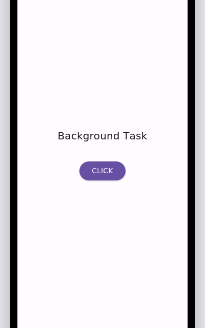
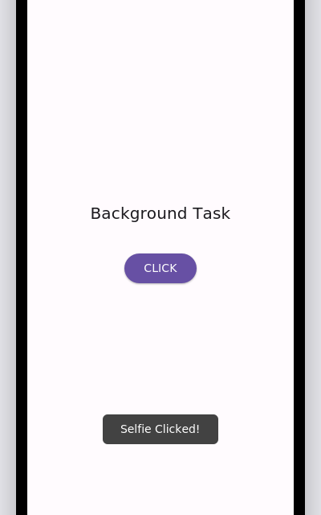

# Android Background Task

A minimal Android app that demonstrates how to run work off the main UI thread using **`AsyncTask`**. On launch, the app opens an HTTP connection to a URL in the background, reads the response, and logs it — all without blocking the UI. A button on screen also shows how to handle a simple click event with a `Toast`.

<p align="center">
  
  &nbsp;&nbsp;
  
</p>

<p align="center">
  <em>Left: home screen &nbsp;|&nbsp; Right: toast shown after tapping "Click"</em>
</p>

> **Note:** The screenshots above are UI mockups generated to match the app's actual layout and Material 3 theme (colors, spacing, and text), since no Android emulator was available to capture a live screen recording. Build and run the app locally to see the real thing.

## What it does

- **On app start**, `MainActivity` kicks off a background task (`Bg extends AsyncTask<String, Void, String>`) that:
  1. Opens an `HttpURLConnection` to `https://www.codewithharry.com/`
  2. Reads the full response body on a background thread
  3. Logs the result to Logcat (tag: `amit`) once the task completes
- **Tapping the "Click" button** shows a `Toast` that says *"Selfie Clicked!"* — a simple example of wiring a click handler via `android:onClick` in XML.

## Why `AsyncTask`

This project is intentionally simple and is meant as a learning example of the classic `AsyncTask` pattern:

| Method | Runs on | Purpose |
|---|---|---|
| `onPreExecute()` | Main thread | Setup before the task starts |
| `doInBackground()` | Background thread | Network / long-running work |
| `onPostExecute()` | Main thread | Handle the result once done |

> `AsyncTask` has been deprecated since Android API 30 in favor of `java.util.concurrent`, Kotlin coroutines, or `WorkManager`. It's used here purely for educational purposes to illustrate the fundamentals of background threading on Android.

## Project structure

```
app/src/main/java/com/example/backgroundtask/
└── MainActivity.java      # Activity + AsyncTask (Bg) + button click handler

app/src/main/res/layout/
└── activity_main.xml      # TextView ("Background Task") + Button ("Click")

app/src/main/AndroidManifest.xml   # INTERNET permission + launcher activity
```

## Requirements

- Android Studio (Giraffe or newer recommended)
- JDK 11
- Android SDK with:
  - `compileSdk` / `targetSdk`: 36
  - `minSdk`: 24

## Getting started

1. **Clone the repo**
   ```bash
   git clone <this-repo-url>
   cd android-background-task-main
   ```
2. **Open in Android Studio**
   - `File → Open` and select the project's root folder.
   - Let Gradle sync finish (it will pull dependencies via the version catalog in `gradle/libs.versions.toml`).
3. **Run it**
   - Select an emulator or a connected device (API 24+) and click **Run ▶**.
   - Or from the command line:
     ```bash
     ./gradlew installDebug
     ```
4. **Watch the background task work**
   - Open **Logcat** in Android Studio and filter by tag `amit` to see the pre-execute log and the fetched page content once the request finishes.
   - Tap **Click** on the screen to see the toast.

## Permissions

The app declares a single permission in `AndroidManifest.xml`:

```xml
<uses-permission android:name="android.permission.INTERNET" />
```

This is required since the background task performs a network request.

## Tech stack

- **Language:** Java
- **Min SDK:** 24 · **Target/Compile SDK:** 36
- **UI:** `ConstraintLayout`, `AppCompatActivity`, Material 3 theme (`Theme.Material3.DayNight.NoActionBar`)
- **Build system:** Gradle with a version catalog (`libs.versions.toml`)
- **Key libraries:** AndroidX AppCompat, Material Components, ConstraintLayout, Activity

## Possible improvements

- Replace `AsyncTask` with a modern approach: `ExecutorService` + `Handler`, Kotlin `Coroutines`, or `WorkManager` for guaranteed/deferred background execution.
- Display the fetched network response in the UI instead of only logging it.
- Add error handling/UI feedback for failed network requests.
- Add unit/instrumentation tests around the networking logic.

## License

No license file is currently included. Add one (e.g. MIT) if you plan to share or accept contributions to this repo.
